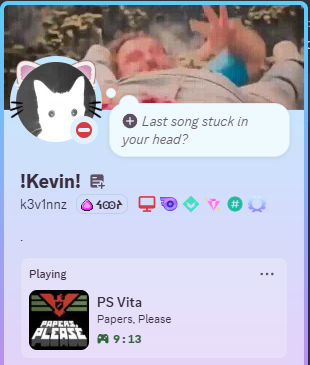

# VitaPresence
Change your Discord rich presence to your currently playing PS Vita game!
This fork of VitaPresence uses the IGDB API to try and fetch an image for the detected game to use for the rich presence image.

Inspired by [SwitchPresence](https://github.com/Sun-Research-University/SwitchPresence-Rewritten)
 

Works with PSVita & Adrenaline (including custom bubbles) games/apps

## Disclaimer
The client app (on Windows PC) must be running in the background, and the PC must be on the same network as your Vita.

It would be nice to have rich presence working with only the Vita itself, but this isn't currently possible due to Discord's RPC API restrictions.

## Setup
- Install the .skprx plugin within the `*KERNEL` section of your taiHEN config.txt.
- Create an application at the [Discord Developer Portal](https://discordapp.com/developers/applications/), call your application `PS Vita` or whatever you would like and then enter your client ID and Vita's IP or MAC address into the VitaPresence client!
- Add a image named "invalid" to the rich presence assets of the discord application you made. This will be used when it can't find the game.
- Make an application in the [Twitch developer dashboard](https://dev.twitch.tv/console) with a redirect URL of "http://localhost" and have the client type be confidential.
- Generate a client secret for the Twitch application and copy the client id and the client secret to the igdb client id and igdb client secret fields in the desktop app.
 

## Credits
- [Sun-Research-University](https://github.com/Sun-Research-University) for the idea & desktop app codebase
